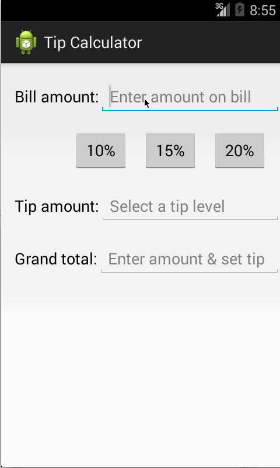

Tip Calculator
====
## Overview
A Tip Calculator utility app which allows a user to calculate the appropriate tip based on the total amount entered.

Time Spent: 3.5 hours

## User Stories

### Mandatory
1. [X] User is displayed the tip of specified percentage for specified entered amount
2. [X] User enters the total amount of the transaction
3. [X] User can select between tip amounts (i.e 10%, 15%, 20%)
4. [X] Upon selecting tip amount, formatted tip value is displayed

### Optional
5. [ ] User changes the total amount and updated tip is reflected automatically
6. [ ] User can select custom tip percentage if desired
7. [ ] User can select how many ways to split the tip
8. [ ] User can edit preset tip percentages and have them persist across launches
9. [ ] Experiment with trying input widgets to replace the buttons and/or textviews
10. [ ] Improve the user interface and experience by using images and/or colors

## Walkthroughs

GIFs created by LiceCap <http://www.cockos.com/licecap/>
